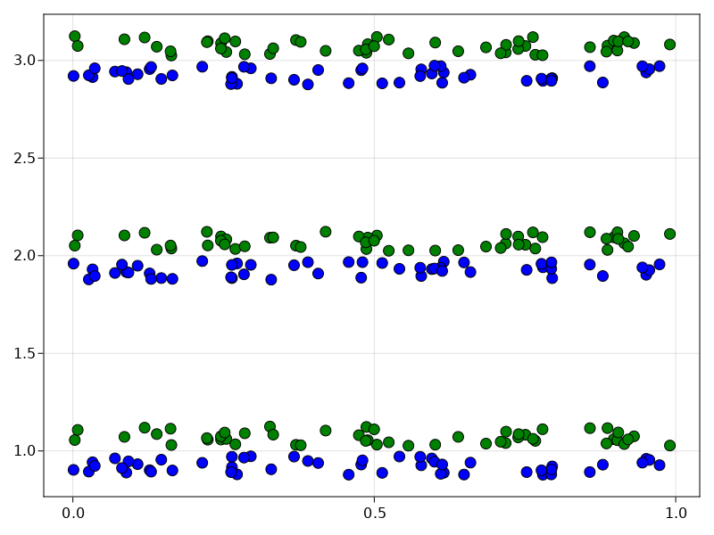

# Jitterplot
These functions help drawing jitter plots in Makie.jl plotting system
# Install
```julia
using Pkg;
Pkg.add("https://github.com/4SAnalyticsnModelling/Jitterplot.git");
```
# Functions
```
jitterplot(x, y, width_jit; kwargs...);

jitterplot!(x, y, width_jit; kwargs...);

```
# Attributes

```
width_jit:                   fraction between 0 and 1; determines the spread of scatter points
kwargs:                      keyword arguments similar to the attributes of scatter function in Makie.jl
dodge_group:                 a keyword argument that defines the groups in a paired (dodged) jitter plot; a
                             vector or an array of integers or floating point numbers; for paired (dodged)
                             jitter plots the 'dodge_group' argument must be provided
dodge_color:                 a keyword argument that controls color of each jitter in a paired (dodged)
                             jitter plot; a list of symbols defining color of each dodged jitter
                             in a pair; 'dodge_color' and 'color' keyword arguments must not be used together
                             since the 'color' keyword argument overwrites the 'dodge_color' argument and
                             produces unwanted outputs
dodge_gap:                   a keyword argument that controls the gap between paired (dodged) jitters; a  
                             fraction between 0 and 1; default value is 1.0
direction:                   a keyword argument that controls the direction of jitter plot; :horizontal is
                             parallel to x-axis and :vertical is parallel to y-axis; default value is
                             :vertical

```

# Examples
```julia
using Jitterplot;
using CairoMakie;

x = repeat(1:3, inner = 100);
y = repeat(rand(100), outer = 3);

Jitterplot.jitterplot(x, y, 0.2)
```
<p align="center">
  
</p>

```julia
f = Figure();
ax = Axis(f[1, 1]);
Jitterplot.jitterplot!(x, y, 0.2,
                      color = :green,
                      markersize = 12,
                      strokewidth = 1.0);
f
```
<p align="center">
  
</p>

```julia
dodge_group = repeat(1:2, outer = 150);
dodge_color = [:blue, :green];
f = Figure();
ax = Axis(f[1, 1]);
Jitterplot.jitterplot!(x, y, 0.1,
                      dodge_gap = 0.3,
                      dodge_group = dodge_group,
                      dodge_color = dodge_color,
                      markersize = 12,
                      strokewidth = 1.0);
f
```
<p align="center">
  
</p>

```julia
f = Figure();
ax = Axis(f[1, 1]);
Jitterplot.jitterplot!(x, y, 0.1,
                      dodge_gap = 0.3,
                      dodge_group = dodge_group,
                      dodge_color = dodge_color,
                      markersize = 12,
                      strokewidth = 1.0,
                      direction = :horizontal);
f
```
<p align="center">
  
</p>
