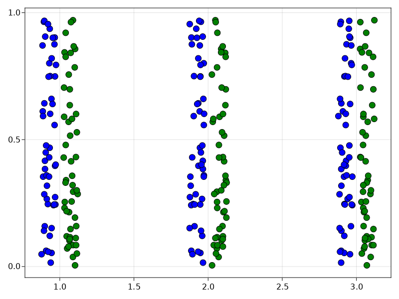

# Jitterplot
These functions help drawing jitter plots in Makie.jl plotting system
# Use the functions as follows
```julia
using Pkg;
Pkg.add("https://github.com/4SAnalyticsnModelling/Jitterplot.git");
```
# Examples
```julia
using Jitterplot;
using CairoMakie;

x = repeat(1:3, inner = 100);
y = repeat(rand(100), outer = 3);

jitterplot(x, y, 0.2)
```
<p align="center">
  
</p>

```julia
f = Figure();
ax = Axis(f[1, 1]);
jitterplot!(x, y, 0.2, color = :blue, markersize = 12, strokecolor = :black);
f
```
<p align="center">
  
</p>

```julia
dodge_group = repeat(1:2, outer =150);
dodge_color = [:blue, :green];
f = Figure();
ax = Axis(f[1, 1]);
jitterplot!(x, y, 0.1, gap_jit = 0.3, dodge_group = dodge_group, dodge_color = dodge_color, markersize = 12);
f
```
<p align="center">
  
</p>
